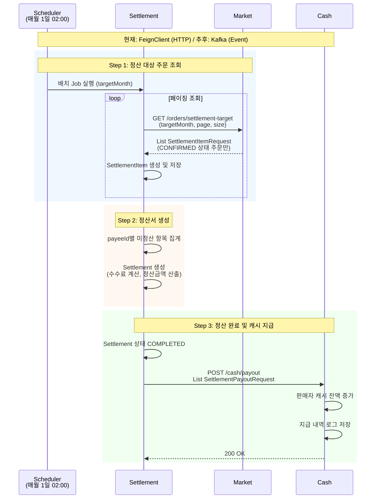
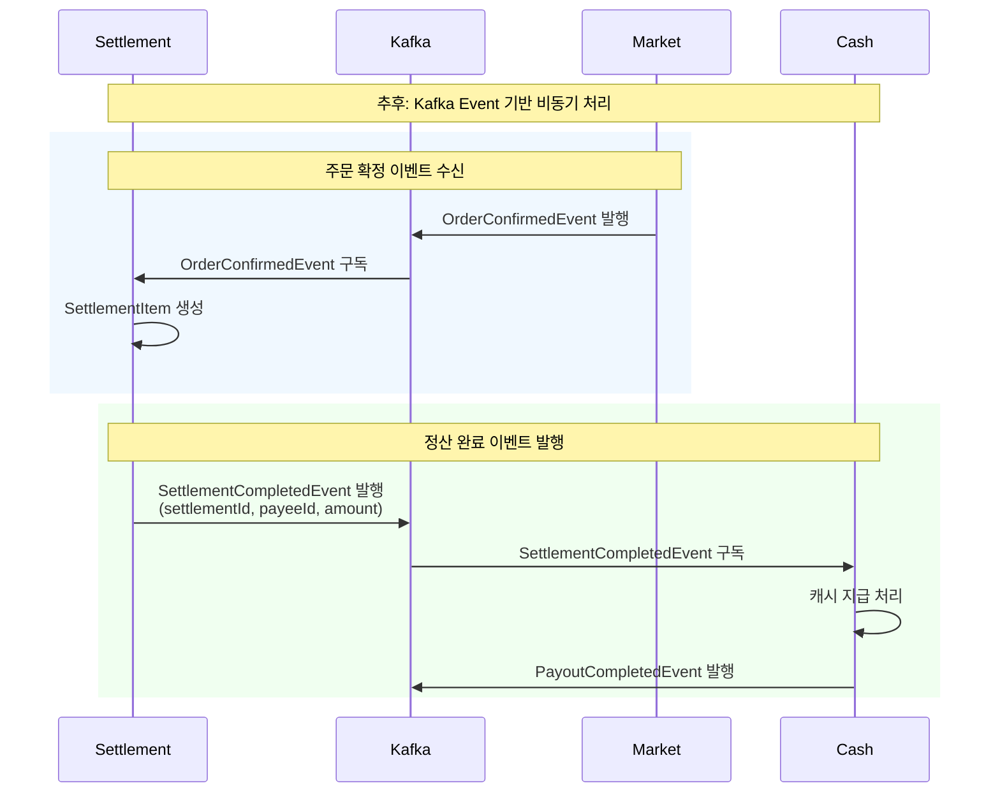
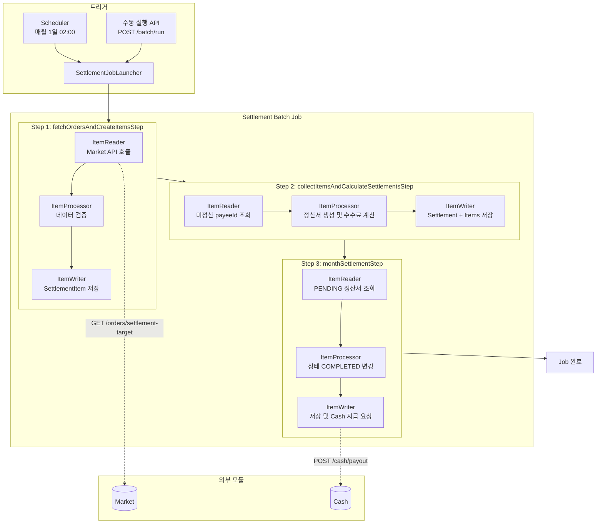
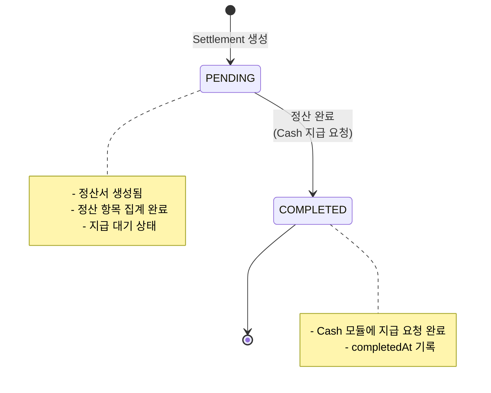
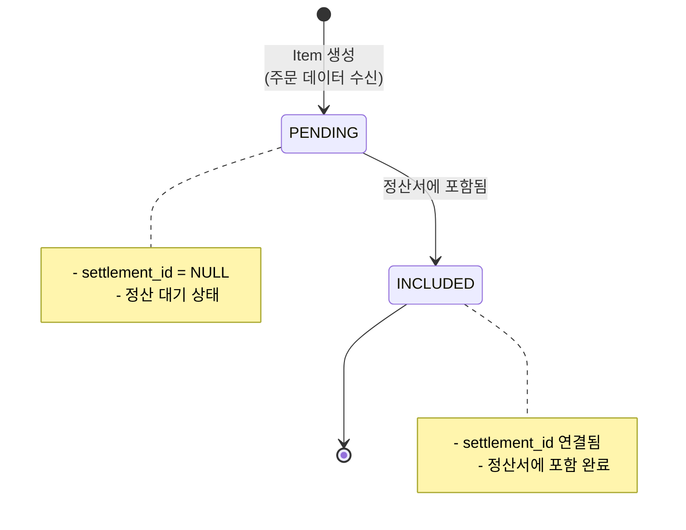

# 정산 배치 시스템

## 개요

월간 정산을 자동으로 처리하는 Spring Batch 기반 배치 시스템입니다.

- **실행 주기**: 매월 1일 02:00 (전월 정산)
- **처리 방식**: Chunk 기반 (100건 단위)
- **외부 연동**: Market 모듈(주문 조회), Cash 모듈(캐시 지급)

---

## 모듈 간 통신 흐름

### 현재: FeignClient (HTTP)



### 추후: Kafka (Event 기반)



---

## 전체 배치 흐름



---

## 배치 Step 상세

### Step 1: fetchOrdersAndCreateItemsStep

Market 모듈에서 정산 대상 주문을 조회하여 `SettlementItem`을 생성합니다.

| 구성 요소 | 설명 |
|-----------|------|
| **ItemReader** | Market API 페이징 호출 (`OrderClient.findSettlementTargetOrders`) |
| **ItemProcessor** | 데이터 검증 (로깅) |
| **ItemWriter** | `SettlementItem` 저장 (판매대금 + 수수료 항목) |

**생성되는 SettlementItem:**
- `SETTLEMENT_PRODUCT_SALES_AMOUNT`: 판매자에게 지급할 판매대금
- `SETTLEMENT_PRODUCT_SALES_FEE`: 플랫폼이 수취할 수수료

### Step 2: collectItemsAndCalculateSettlementsStep

`payeeId`별로 미정산 항목을 집계하여 정산서(`Settlement`)를 생성합니다.

| 구성 요소 | 설명 |
|-----------|------|
| **ItemReader** | 미정산 `payeeId` 목록 조회 |
| **ItemProcessor** | 정산서 생성, 수수료 계산 (플랫폼 수수료 10%) |
| **ItemWriter** | `Settlement` + `SettlementItem` 연결 및 저장 |

**수수료 계산:**
```
총 판매금액 = SUM(SETTLEMENT_PRODUCT_SALES_AMOUNT)
플랫폼 수수료 = 총 판매금액 × 10%
정산 지급액 = 총 판매금액 - 플랫폼 수수료
```

### Step 3: monthSettlementStep

`PENDING` 상태의 정산서를 완료 처리하고 Cash 모듈에 지급 요청합니다.

| 구성 요소 | 설명 |
|-----------|------|
| **ItemReader** | `PENDING` 상태 정산서 페이징 조회 |
| **ItemProcessor** | 상태 `COMPLETED` 변경, `PayoutRequest` 생성 |
| **ItemWriter** | 정산서 저장, Cash 모듈에 지급 요청 |

---

## 상태 흐름

### Settlement 상태



### SettlementItem 상태



---

## 외부 모듈 API 스펙

### Market 모듈

**정산 대상 주문 조회**

```
GET /api/v1/orders/settlement-target
```

| Parameter | Type | Description |
|-----------|------|-------------|
| targetMonth | String (yyyy-MM) | 정산 대상 월 |
| page | int | 페이지 번호 |
| size | int | 페이지 크기 |

**Response:**
```java
public record SettlementItemRequest(
    Long orderId,
    Long productId,
    Long buyerId,
    Long sellerId,
    String sellerName,
    BigDecimal price,
    LocalDateTime confirmedAt
) {}
```

**조회 조건:**
- `confirmedAt`이 `targetMonth` 기간 내
- 주문 상태가 `CONFIRMED` 또는 `COMPLETED`
- 환불/취소 상태 제외 (`REFUNDED`, `CANCELED`)

### Cash 모듈

**캐시 지급 요청**

```
POST /api/v1/cash/payout
```

**Request Body:**
```java
public record SettlementPayoutRequest(
    Long settlementId,
    Long payeeId,
    String payeeName,
    BigDecimal amount,
    LocalDateTime completedAt
) {}
```

**처리 내용:**
- 해당 유저(`payeeId`)의 캐시 잔액 증가
- 지급 내역 로그 저장

---

## 실행 방법

### 자동 실행 (스케줄러)

매월 1일 02:00에 자동 실행됩니다.

```java
@Scheduled(cron = "0 0 2 1 * *")
public void runMonthlySettlement() {
    YearMonth targetMonth = YearMonth.now().minusMonths(1);
    settlementJobLauncher.run(targetMonth);
}
```

### 수동 실행 (API)

```bash
curl -X POST "http://localhost:8080/api/v1/settlements/batch/run?targetMonth=2024-01"
```

**Response:**
```json
{
  "code": 200,
  "message": "OK",
  "data": {
    "jobId": 1,
    "status": "COMPLETED",
    "targetMonth": "2024-01",
    "startTime": "2024-02-01T02:00:00",
    "endTime": "2024-02-01T02:05:30"
  }
}
```

---

## 설정

### application.yml

```yaml
settlement:
  system-payee-id: 1  # 플랫폼 수수료 수취 계정 ID

spring:
  batch:
    job:
      enabled: false  # 자동 실행 비활성화 (스케줄러로 제어)
```

### 상수 (SettlementPolicy)

```java
public final class SettlementPolicy {
    public static final int CHUNK_SIZE = 100;
    public static final BigDecimal PLATFORM_FEE_RATE = new BigDecimal("0.10");  // 10%
}
```

---

## 패키지 구조

```
settlement/
├── adapter/
│   ├── in/
│   │   └── SettlementControllerV1.java
│   └── out/
│       ├── feign/
│       │   ├── cash/
│       │   │   ├── CashClient.java
│       │   │   ├── CashFeignClient.java
│       │   │   └── TestCashClient.java
│       │   └── market/
│       │       ├── OrderClient.java
│       │       ├── OrderFeignClient.java
│       │       └── TestOrderClient.java
│       ├── SettlementRepository.java
│       └── SettlementItemRepository.java
├── app/
│   ├── dto/
│   │   ├── request/
│   │   └── response/
│   ├── event/
│   │   ├── SettlementItemRequest.java
│   │   └── SettlementPayoutRequest.java
│   ├── facade/
│   │   └── SettlementFacade.java
│   ├── support/
│   │   └── SettlementSupport.java
│   └── usecase/
│       ├── SettlementUseCase.java
│       ├── SettlementItemAddUseCase.java
│       ├── SettlementCreateUseCase.java
│       └── SettlementCompleteUseCase.java
├── batch/
│   ├── SettlementJobConfig.java
│   ├── SettlementJobLauncher.java
│   ├── SettlementScheduler.java
│   ├── SettlementFetchOrdersStepConfig.java
│   ├── SettlementCollectItemsAndCalculateSettlementsStepConfig.java
│   └── SettlementMonthSettlementStepConfig.java
├── config/
│   ├── HttpClientConfig.java
│   └── SchedulerConfig.java
└── domain/
    ├── Settlement.java
    ├── SettlementItem.java
    ├── SettlementStatus.java
    ├── SettlementItemStatus.java
    ├── SettlementEventType.java
    └── SettlementPolicy.java
```
